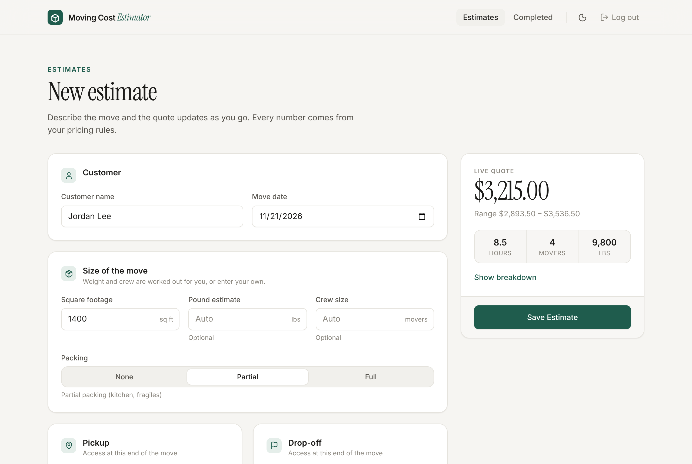
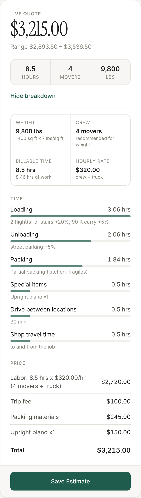
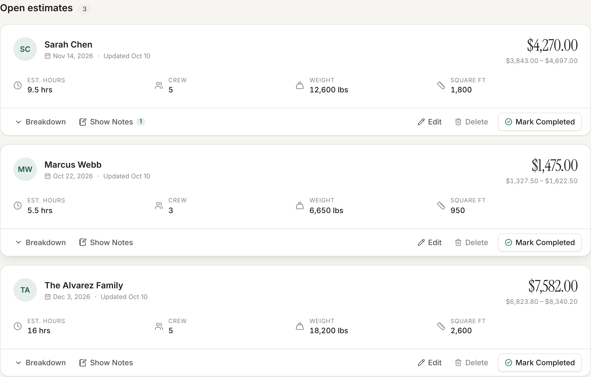
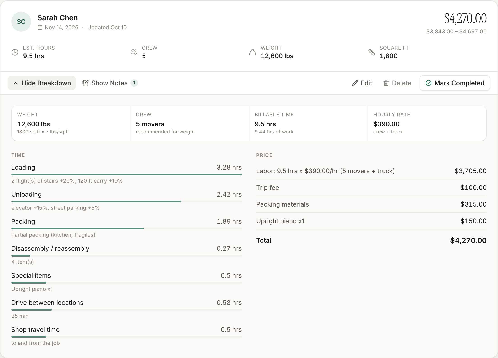
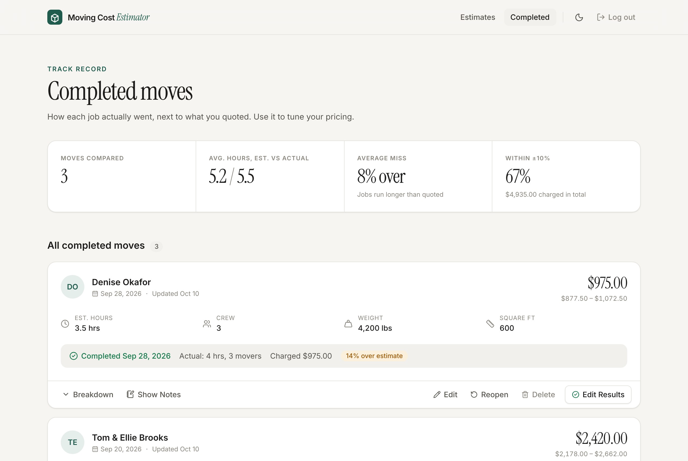
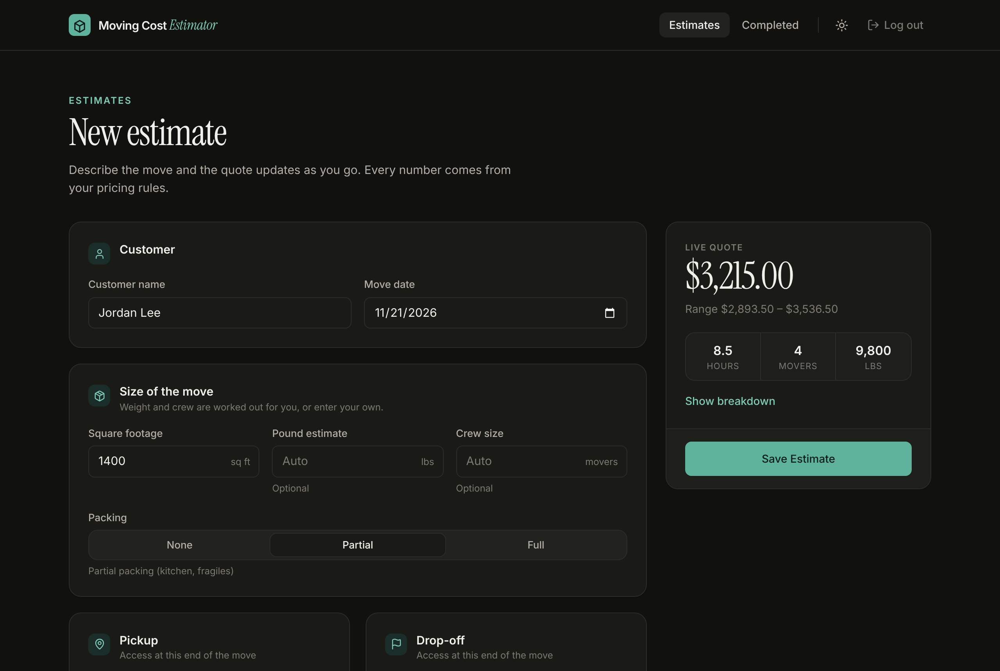
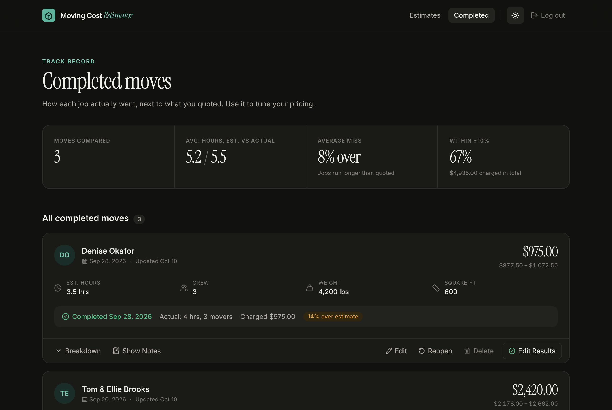
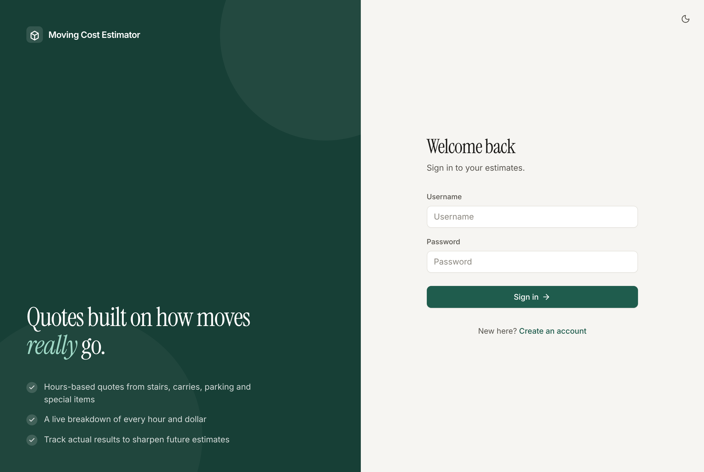
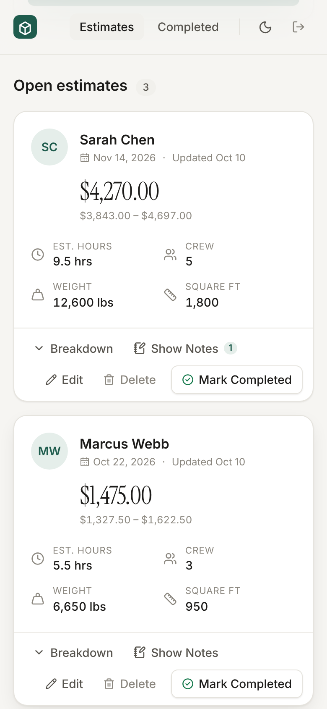

# Moving Cost Estimator

**Hours-based quotes for local moves, built on how jobs actually go.**

A full-stack web app for creating moving estimates. You describe the move: size, stairs, carry distance, parking, packing and special items like pianos and safes. It works out how many hours the crew will need and what to charge, and shows the full breakdown as you type. After the job, you record what actually happened, and the app tracks how accurate your estimates are over time.

The pricing logic comes from years of working in the moving industry, and every rate and rule can be adjusted in one file.



---

## Features

- **Live quote.** The price, billable hours, crew size and weight update as you fill in the form.
- **Hours-based pricing engine.** It accounts for stairs, elevators, long carries, truck parking, packing, furniture disassembly, drive time and special items.
- **Full breakdown.** Every estimate shows exactly where the hours and dollars come from.
- **Smart defaults.** Leave weight or crew size blank and the app estimates them from square footage.
- **Notes on each estimate** for access details, fragile items, or anything the crew should know.
- **Completed moves tracking.** Record actual hours, crew and final price, and see how far off each estimate was.
- **Accuracy dashboard** showing average miss, estimated vs. actual hours and the share of jobs within ±10%.
- **Light and dark mode.** Follows your system setting, with a toggle in the top bar.
- **Responsive.** Works on desktop and phone.
- **JWT authentication.** Each user only sees their own estimates.

## Screenshots

### Live quote and breakdown

As you describe the move, the quote panel shows the price range, billable hours and crew. Open the breakdown to see the time spent on each step and every line of the price.

<p align="center">
  
</p>

### Saved estimates

Saved estimates show the key numbers at a glance. Each card can show its breakdown, show its notes, be edited, or be marked as completed.





### Completed moves

Record how each job actually went. The summary at the top shows whether your estimates tend to run long or short, which tells you which numbers to adjust.



### Dark mode





### Sign in and mobile



<p align="center">
  
</p>

---

## How estimates are priced

All pricing lives in [`backend/api/pricing.py`](backend/api/pricing.py). An estimate is built in five steps:

1. **Weight:** the pound estimate if one is entered, otherwise square footage × lbs per sq ft.
2. **Crew:** the crew size if one is entered, otherwise picked from weight thresholds.
3. **Hours:**
   - **Load and unload time:** weight ÷ crew speed, slowed by each end's access (stairs, elevator, carry distance and parking).
   - **Other work:** packing, furniture assembly and special items.
   - **Travel:** drive time between the two homes, plus travel to and from the shop.
4. **Billable hours:** rounded up to the billing increment, with a minimum.
5. **Price:** billable hours × (crew × per-mover rate + truck rate) + trip fee + packing materials + special item fees, shown with a ± range.

### Tuning the numbers

Every value is in the `PRICING` dictionary at the top of `pricing.py`:

| Setting | What it controls |
|---|---|
| `HOURLY_RATE_PER_MOVER`, `TRUCK_HOURLY_RATE`, `TRIP_FEE` | Rates |
| `MINIMUM_HOURS`, `BILLING_INCREMENT_HOURS`, `SHOP_TRAVEL_HOURS` | Billing rules |
| `LBS_PER_SQFT`, `CREW_BY_WEIGHT` | Weight and crew defaults |
| `LBS_PER_MOVER_HOUR_LOAD` / `_UNLOAD` | How fast a crew works under ideal conditions |
| `STAIRS_PCT_PER_FLIGHT`, `ELEVATOR_PCT`, `LONG_CARRY_*`, `PARKING` | Access penalties |
| `PACKING` | Packing levels: time and materials |
| `SPECIAL_ITEMS` | Pianos, safes, hot tubs, etc.: extra time and fees |

If you add an item to `SPECIAL_ITEMS` or a level to `PACKING`, it appears in the form automatically. Saved estimates keep the price they were quoted at until they're edited.

---

## Tech stack

| Layer | Tools |
|---|---|
| Frontend | React 19, Vite, Tailwind CSS v4, React Router, Axios, lucide-react icons |
| Backend | Django, Django REST Framework, Simple JWT |
| Database | SQLite (local dev) / PostgreSQL (Docker and production) |
| Testing | Django test runner (backend), Vitest + React Testing Library (frontend) |
| Deployment | Docker Compose: Postgres, Django on gunicorn, React served by nginx |

---

## Getting started

### Requirements

- Python **3.12+**
- Node.js **20.19+** (22 LTS recommended)

### Run locally

**Backend:**

```bash
cd backend
cp .env.example .env              # turns on DEBUG for local development
python3 -m venv venv
source venv/bin/activate          # Windows: venv\Scripts\activate
pip install -r ../requirements.txt
python manage.py migrate
python manage.py runserver
```

**Frontend** (in a second terminal):

```bash
cd frontend
npm install
npm run dev
```

Open **http://localhost:5173**, create an account and sign in.

The frontend talks to `http://127.0.0.1:8000` by default. To point it somewhere else, set `VITE_API_URL` (for example in `frontend/.env`).

### Run with Docker

The whole stack runs with one command:

```bash
cp .env.docker.example .env
docker compose up --build
```

- App: http://localhost:5173
- API: http://localhost:8000

Before deploying anywhere public, edit `.env` to set a real `DJANGO_SECRET_KEY` and `POSTGRES_PASSWORD`, and set `DJANGO_ALLOWED_HOSTS` / `DJANGO_CORS_ALLOWED_ORIGINS` to your domain.

### Security defaults

- `DEBUG` is off unless `DJANGO_DEBUG=True`.
- A `DJANGO_SECRET_KEY` is required whenever `DEBUG` is off.
- Only the listed hosts and CORS origins are allowed.

---

## Running tests

```bash
# Backend: API and pricing engine tests
cd backend
python manage.py test api

# Frontend: component and page tests
cd frontend
npm test
```

The pricing engine tests run against a fixed copy of the config, so you can change the numbers in `pricing.py` without breaking them.

---

## API

All endpoints except register and token require a JWT (`Authorization: Bearer <token>`); requests without one get `401 Unauthorized`.

| Method | Endpoint | Description |
|---|---|---|
| `POST` | `/api/user/register/` | Create an account |
| `POST` | `/api/token/` · `/api/token/refresh/` | Get / refresh JWT tokens |
| `GET` | `/api/estimates/?status=open\|completed` | List your estimates |
| `POST` | `/api/estimates/` | Create an estimate (priced server-side) |
| `POST` | `/api/estimates/preview/` | Price a move without saving (live quote) |
| `PATCH` | `/api/estimates/update/<id>/` | Edit an estimate (re-priced) |
| `DELETE` | `/api/estimates/delete/<id>/` | Delete an estimate |
| `PUT` / `DELETE` | `/api/estimates/<id>/completion/` | Record or clear the move's actual results |
| `GET` / `POST` | `/api/estimates/<id>/notes/` | List / add notes |
| `DELETE` | `/api/notes/delete/<id>/` | Delete a note |
| `GET` | `/api/pricing/options/` | Form choices (parking, packing, special items) |

---

## Project structure

```
backend/
  api/
    pricing.py          # the pricing engine; all tunable numbers live here
    models.py           # Estimator, CompletedMove, Note
    views.py            # REST endpoints
    serializers.py      # validation
    tests.py            # API tests
    test_pricing.py     # pricing engine unit tests
  backend/settings.py   # environment-driven settings
frontend/
  src/
    pages/              # Estimate, CompletedMoves, Login, Register
    components/         # EstimateForm, EstimateCard, Breakdown, controls...
    index.css           # design tokens (light and dark palettes)
    ui.js               # shared styles and formatters
docs/screenshots/       # images used in this README
docker-compose.yml
```

### Styling

Colors are semantic design tokens (`canvas`, `surface`, `ink`, `accent`, etc.) defined once in `frontend/src/index.css` with light and dark palettes, and used as Tailwind classes like `bg-surface` and `text-ink-2`. To change the look, change the palette there. The fonts, Inter and Instrument Serif, are bundled with `@fontsource`, so the app makes no external requests.

---

## Roadmap

- [ ] Tune `pricing.py` with real job data
- [ ] Room-by-room item inventory instead of square footage
- [ ] Long-distance moves (mileage-based pricing)
- [ ] Printable / emailable customer quotes
- [ ] Suggest pricing adjustments automatically from completed-move data
- [ ] Deploy (AWS Lightsail or similar) with invite-only sign-up
